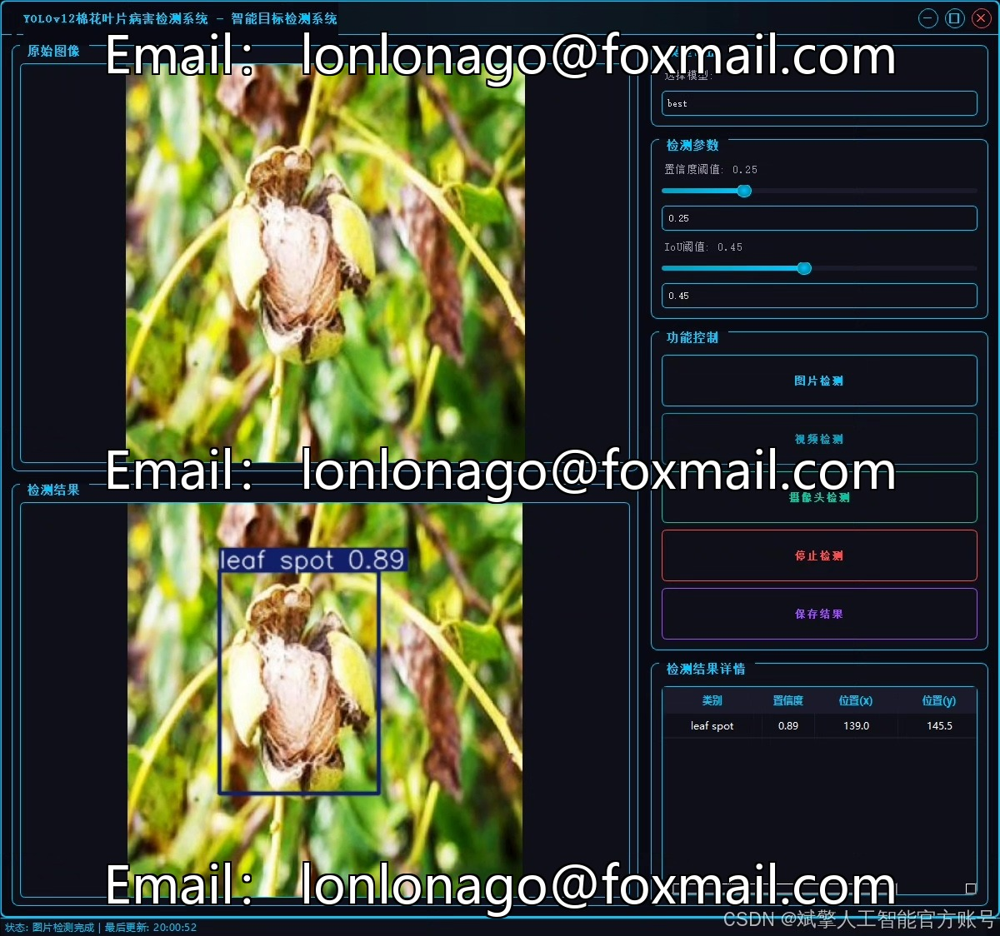
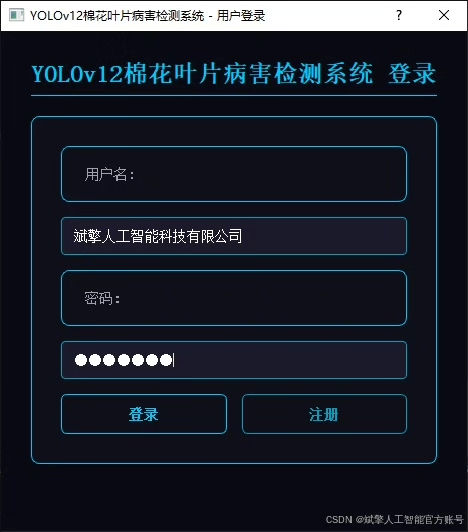
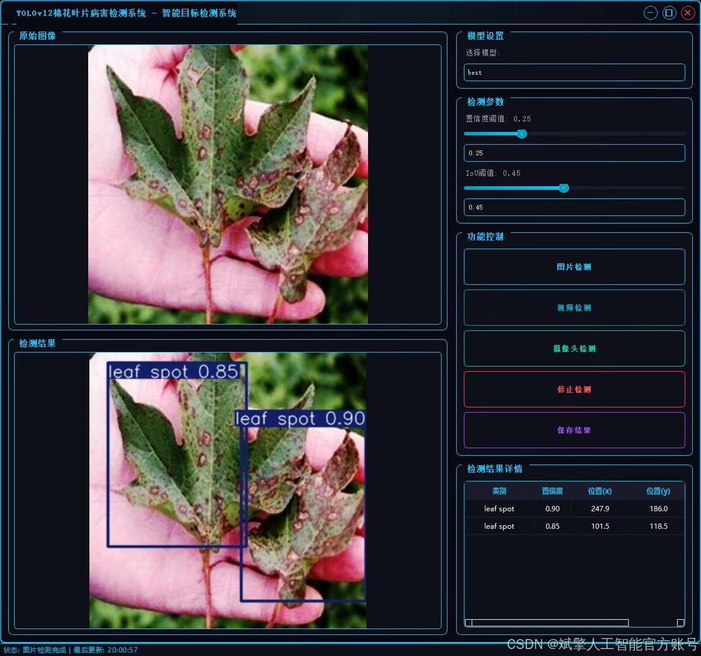
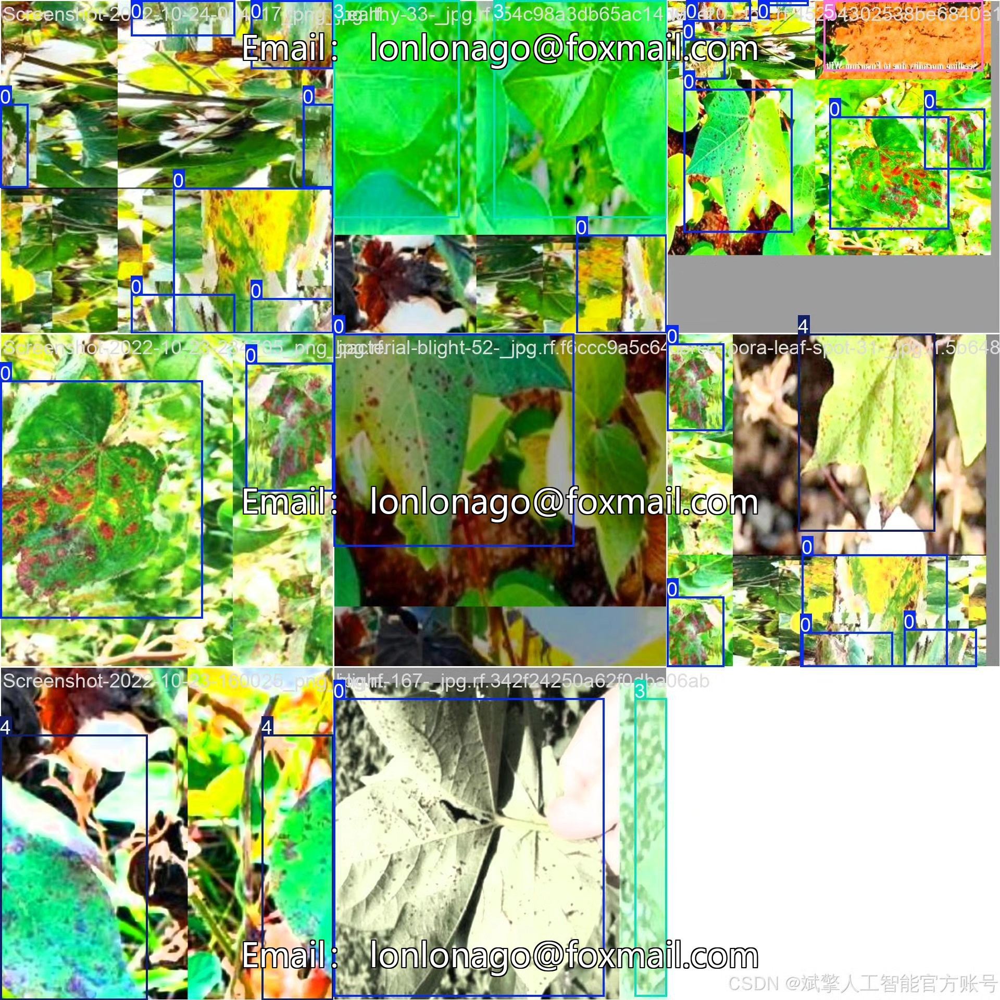
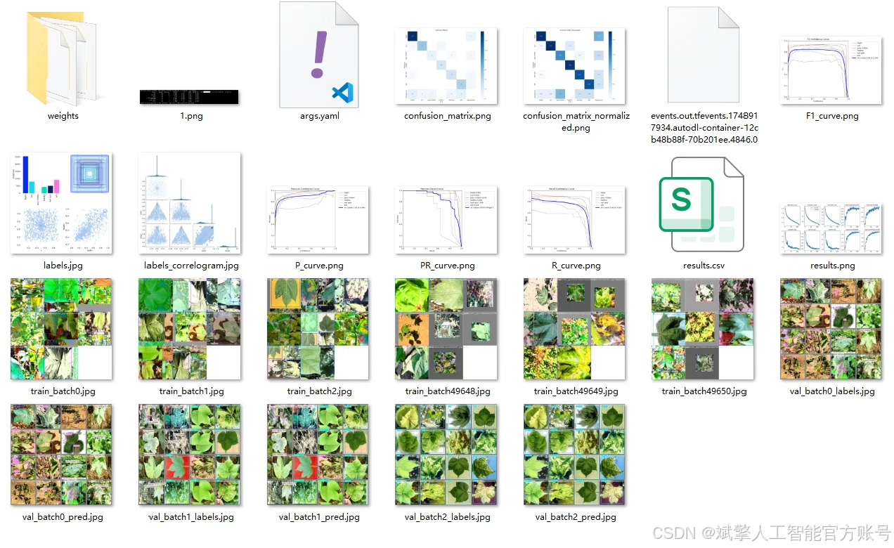
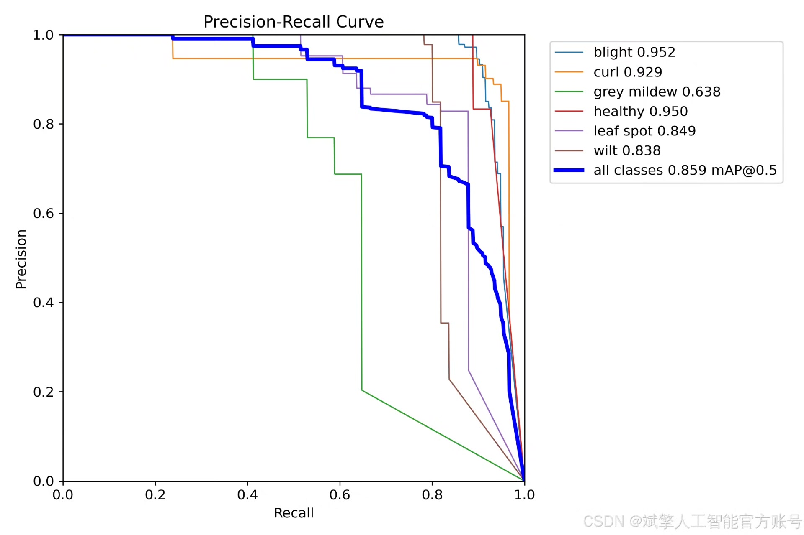
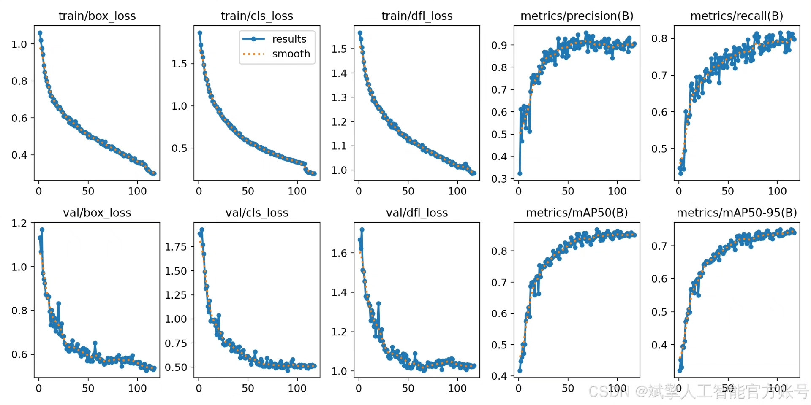
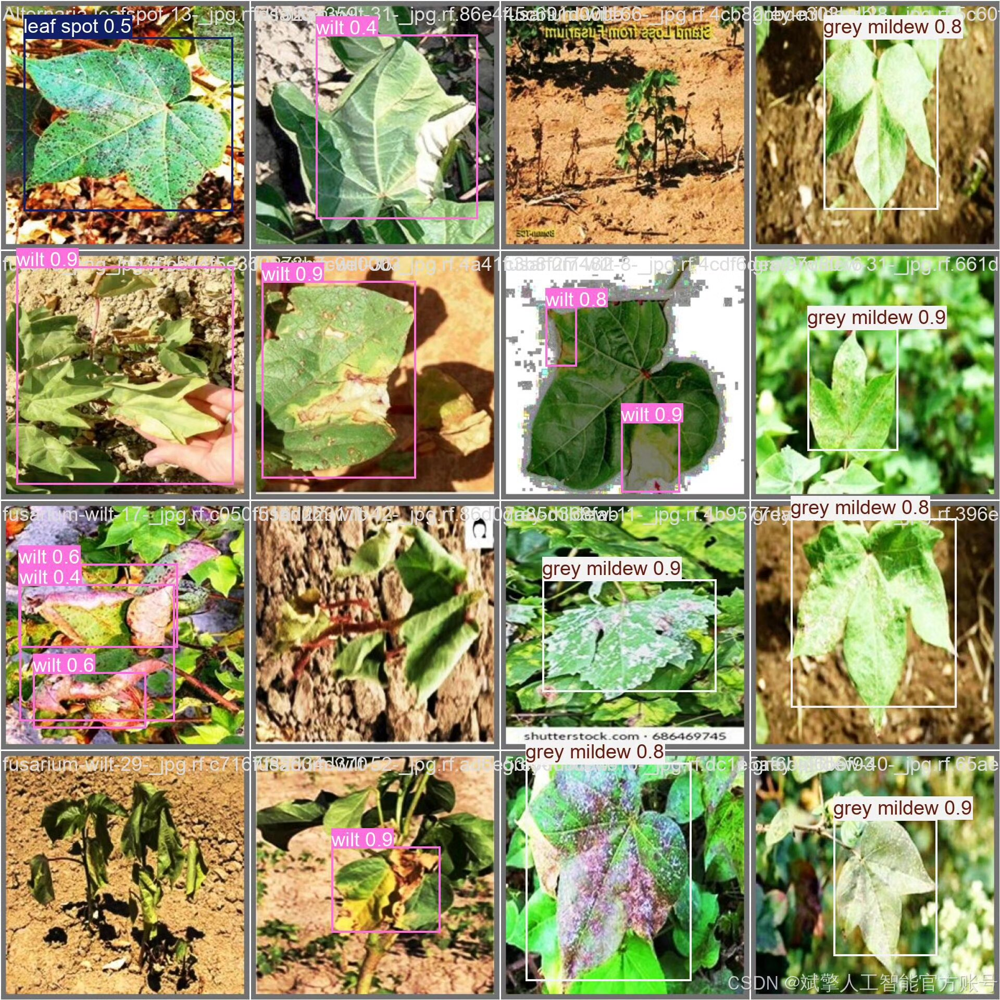

# YOLOv12 cotton disease identification system

## Body

YOLOv12 Cotton Disease Identification System Based on Deep Learning YOLOv12: A Cotton Leaf Disease Detection System (YOLOv12+YOLO dataset + UI interface + login and registration interface + Python project source code + model)

Cotton, as an important economic crop, is directly affected by diseases. Traditional manual inspection methods have low efficiency, strong subjectivity, and limited coverage, urgently requiring efficient and accurate automated disease detection technology. This paper proposes a cotton leaf disease detection system based on deep learning YOLOv12, combining the cotton leaf disease dataset to achieve precise recognition of six types of diseases and health status, including blight, curl, grey mildew, healthy, leaf spot, and wilt. The dataset covers a training set of 3708 images, a validation set of 232 images, and a testing set of 233 images. After data augmentation and optimization labeling, the YOLOv12 model achieved better performance in both detection accuracy and inference speed. In addition, the system is equipped with a visual UI interface and provides login and registration functions. Experimental results show that this system has high robustness and good generalizability in cotton disease detection, providing a feasible solution for agricultural disease monitoring and intelligent management.

✅ User Login and Registration: Supports password verification and security validation.
✅ Three Detection Modes: Based on the YOLOv12 model, supports image, video, and real-time camera detection, accurately identifying targets.
✅ Dual-Screen Comparison: Displays the original scene and detection results on the same screen.
✅ Data Visualization: Real-time table displays the category, confidence, and coordinates of detected targets.
✅ Intelligent Parameter Tuning: Offers a confidence slide bar to dynamically optimize detection accuracy, adapting to different scene needs.
✅ Sci-Fi Interactive Interface: Dark theme combined with dynamic light effects, reducing visual fatigue and improving operational experience.

## Images

## Payment

Here is a pay link on Stripe ( https://buy.stripe.com/3cs8yP7sY87d0vu9AB ). Please contact me lonlonago@foxmail.com after funding $89, and I will send you a complete data files , thank you!

